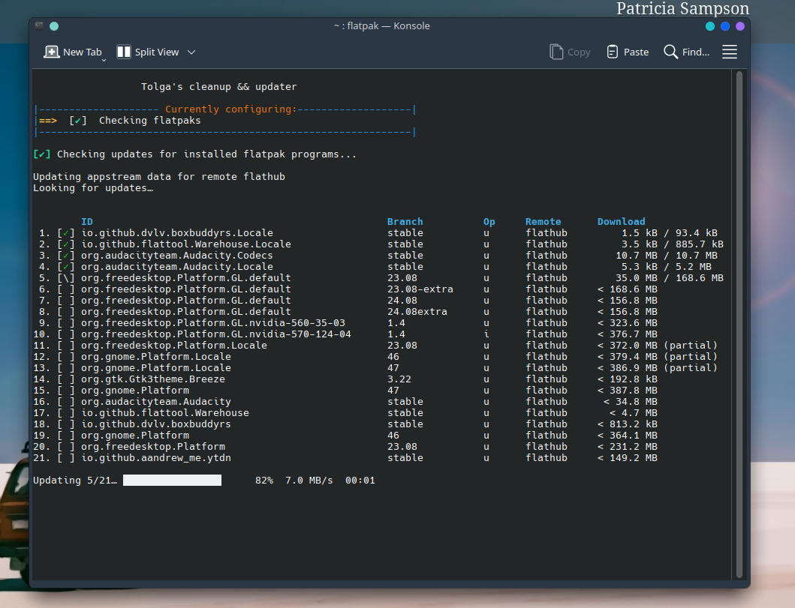

# Personal System and Flatpak Update ALIAS



#

_Location: `./bash.rc`_

```bash
alias tolga-update='
echo -e "\e[1;32m[✔]\e[0m Network is metered. Rotating and vacuuming journal logs...\n" && \
(sudo journalctl --rotate; sudo journalctl --vacuum-time=1s && sleep 1) && \
sleep 1 && \
cleanup_solus && \
display_message "[\e[1;32m✔\e[0m]  Checking flatpaks" && \
echo -e "\e[1;32m[✔]\e[0m Checking updates for installed flatpak programs...\n" && \
sudo flatpak update --appstream && flatpak update && \
sudo flatpak update -y && \
sleep 1 && \
echo -e "\e[1;32m[✔]\e[0m Removing Old Flatpak Cruft...\n" && \
flatpak uninstall --unused && \
flatpak uninstall --delete-data && \
sudo rm -rfv /var/tmp/flatpak-cache-* && \
[ -f /usr/bin/flatpak ] && flatpak uninstall --unused --delete-data --assumeyes && \
flatpak --user uninstall --unused -y --noninteractive && \
/usr/bin/flatpak --user update -y --noninteractive && \
/usr/bin/flatpak --user repair && \
echo -e "\e[1;32m[✔]\e[0m All updates and cleanups are complete."'

# color variables
RED='\e[1;31m'
GREEN='\e[1;32m'
YELLOW='\e[1;33m'
BLUE='\e[1;34m'
CYAN='\e[1;36m'
WHITE='\e[1;37m'
ORANGE='\e[1;93m'
NC='\e[0m'
YELLOW='\e[1;33m'
NC='\e[0m'

display_message() {
    clear
    echo -e "\n                  Tolga's cleanup && updater\n"
    echo -e "\e[34m|--------------------\e[33m Currently configuring:\e[34m-------------------|"
    echo -e "|${YELLOW}==>${NC}  $1"
    echo -e "\e[34m|--------------------------------------------------------------|\e[0m"
    echo ""
    gum spin --spinner dot --title "Stand-by..." -- sleep 1
}

echo "Calling display_message with: [${GREEN}✔${NC}]  Cleanup complete, ENJOY!"
display_message "[${GREEN}✔${NC}]  Cleanup complete, ENJOY!"

countdown() {
    local seconds=$1
    local message=$2

    echo -ne "${message} (Press Enter to skip): "

    read -r -t $seconds -p "" && touch /tmp/skip_fstrim &

    local pid=$!

    while [ $seconds -gt 0 ]; do
        if [ -e /tmp/skip_fstrim ]; then
            echo -e "\nSkipping fstrim due to user input"
            return
        fi
        echo -ne "$seconds\033[0K\r"
        sleep 1
        ((seconds--))
    done
    echo -ne "\n"

    wait $pid
}

cleanup_solus() {
    # Clean package cache
    display_message "[${GREEN}✔${NC}]  Time to clean up system..."
    sudo eopkg clean

    # Remove unnecessary dependencies
    sudo eopkg rmf

    display_message "[${GREEN}✔${NC}] Trimming all mount points on SSD"

    countdown 3 "Starting fstrim"

    # Check for input
    if [ ! -e /tmp/skip_fstrim ]; then
        echo "No input detected. Skipping fstrim."
    else
        # Run fstrim if no input was received
        sudo fstrim -av
    fi

    echo -e "\e[1;32m[✔]\e[0m Restarting kernel tweaks...\n"
    gum spin --spinner dot --title "Stand-by..." -- sleep 2

    display_message "[${GREEN}✔${NC}]  Cleanup complete, ENJOY!"
    #gum spin --spinner dot --title "Stand-by..." -- sleep 2
    echo -e "\e[1;32m[✔]\e[0m Checking system updates .....\n" &&
        sudo eopkg upgrade -y

}
```
